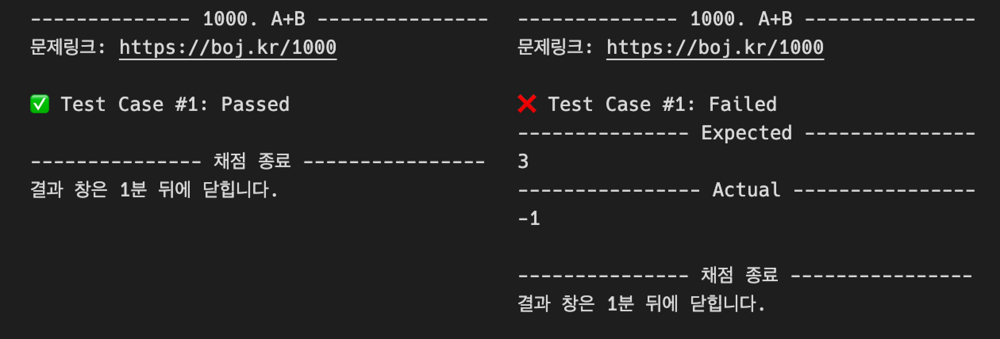

# BOJ-extension

vscode를 위한 백준 온라인 저지 문제 풀이 확장 프로그램입니다.  
백준 온라인 저지를 할 때 편리할법한 기능을 제공합니다.

## 사용법 및 기능

1. 확장을 설치 후 설정에서 자주 사용하는 언어의 확장자와 본인이 백준 온라인 저지에서 사용하는 아이디를 입력합니다.
2. vscode의 사이드 바에서 BOJ-extension 아이콘을 클릭합니다.
3. 버튼을 클릭합니다.

   - `📝 문제 보기`
     - 백준 온라인 저지 문제 번호를 입력하면 해당 문제가 열립니다.
   - `➕ 문제 생성`
     - 백준 온라인 저지 문제 번호를 입력하면 해당 문제의 제목을 파일명으로 하는 파일이 생성되고, 자동으로 헤더가 생성된 후, 문제가 열립니다.
   - `✏️ 헤더 코멘트 삽입`
     - 백준 온라인 저지 문제 번호를 입력하면 해당 파일의 정보를 담은 아름다운 헤더가 생성됩니다.
   - `🚀 GitHub에 푸시`
     - 현재 워크스페이스에 Github Action을 위한 `workflow.yml`파일을 생성하고 깃허브 레포지토리에 푸시합니다.
   - `⚙️ 워크플로우 생성`
     - Github Action을 위한 `workflow.yml`파일을 생성합니다.
   - `📚 매뉴얼 보기`
     - BOJ-extension의 매뉴얼을 엽니다.

   ※ 상응하는 커맨드도 존재합니다.

## BOJ: Run Test Case

지원 언어: C(gcc), C++(g++), Python(python3), Java(javac), Rust(rustc), JS(node)  
※ 각 언어에 상응하는 컴파일러/인터프리터가 설치되어 있어야 작동합니다. JS는 윈도우에서는 지원하지 않습니다.  
내부 캐싱 기능이 구현되어 있습니다.  
원하시는 언어가 있다면 이슈를 남겨주세요. [BOJ-extension Github Issue](https://github.com/dltkdgns00/BOJ-extension/issues)

## Github Action

BOJ-action은 BOJ-extension을 위한 Github Action을 제공합니다.  
BOJ-extension에서 자동으로 생성하는 workflow.yml파일을 사용하면 자신의 Github 레포지토리에 자신이 푼 문제들의 `README.md`파일에 백준 온라인 저지에 제출한 본인의 코드의 성능요약을 추가할 수 있습니다.

## 링크

- [Github repository](https://github.com/dltkdgns00/BOJ-extension)
- [Microsoft Marketplace](https://marketplace.visualstudio.com/items?itemName=dltkdgns00.BOJ-EX)
- [Github Action for BOJ-extension](https://github.com/dltkdgns00/BOJ-action)

## 라이선스

MIT License

## 개발자

- [dltkdgns00](https://github.com/dltkdgns00)

### 후원하기

  
 

- 후원하실 때에 메시지에 Github 아이디를 남겨주시면 후원자 리스트에 추가해드립니다.

### 후원자 리스트

<table>
<tr>
<th>

</th>
</tr>
</table>
